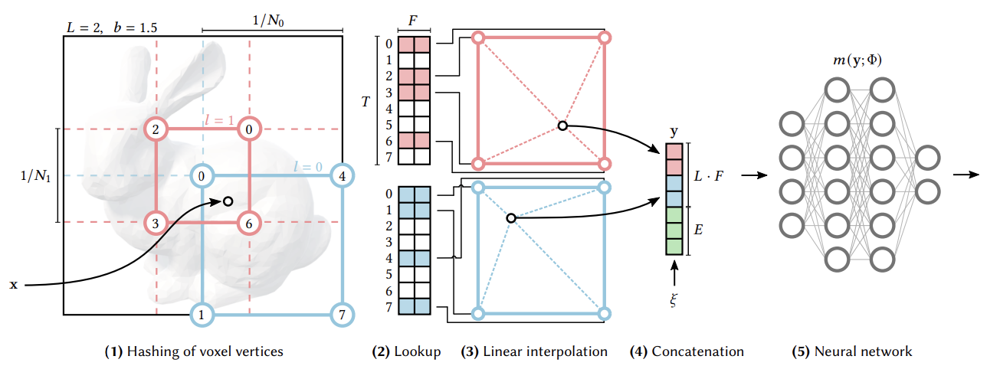
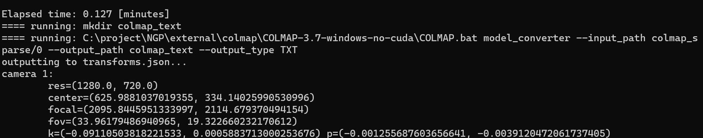
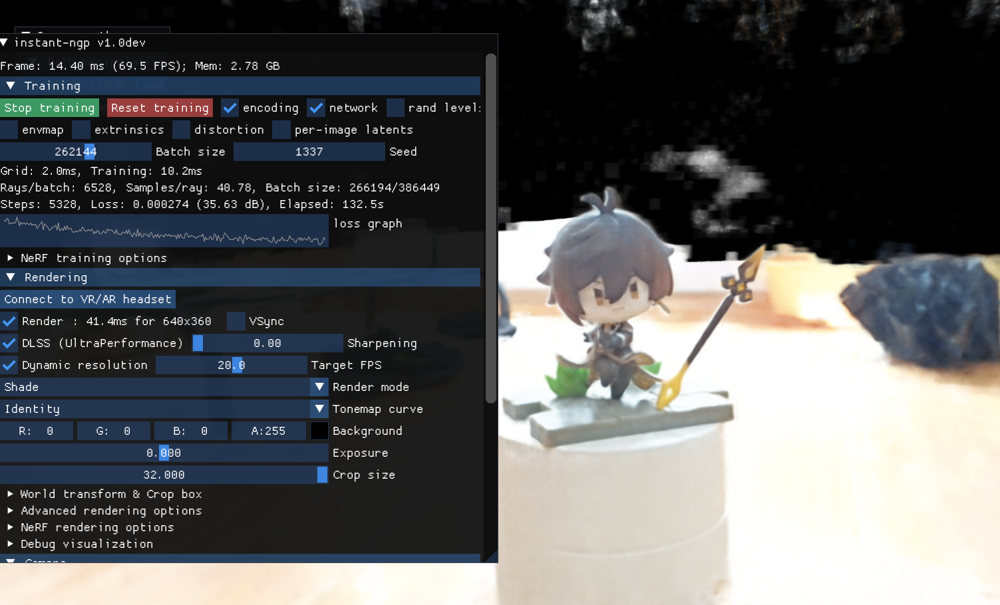
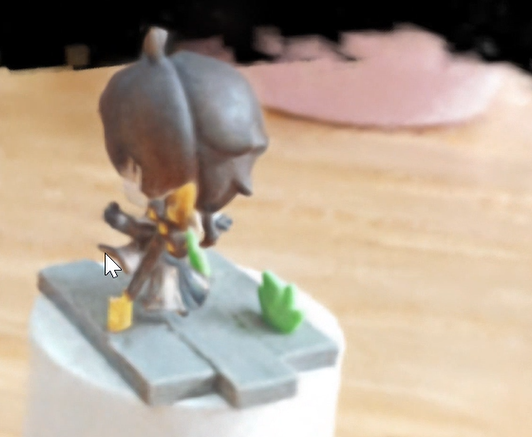
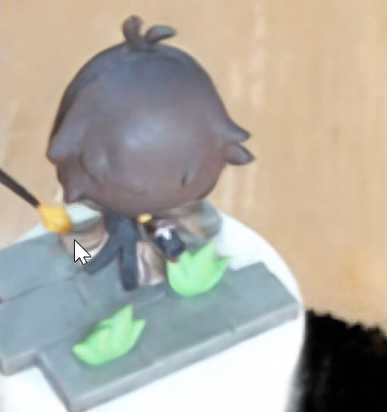

# Instant-NGP 三维重建

为实现 Nerf 三维重建，本报告选用英伟达的 Instant-NGP 来进行三维重建。

实验环境：python=3.9 显卡：RTX4060 cuda版本：11.7  系统：windows11

### 模型架构

Instant-ngp是一种使用多分辨率哈希编码的即时神经图形原语，它可以用更小的神经网络来重建三维场景。它的主要思想是将输入坐标编码为多个不同分辨率的哈希表中的特征向量，然后将这些特征向量拼接起来作为神经网络的输入。这样可以减少参数数量，提高训练速度，同时保持高质量的重建效果。

Instant-ngp的模型结构如下：

- 输入：一个三维坐标点和一个视角方向
- 输出：一个体积密度和一个RGB颜色
- 编码层：将输入坐标映射到L个不同分辨率的哈希表中，每个哈希表有T个特征向量，每个特征向量有F个维度。使用一个简单的哈希函数和三线性插值来获取每个哈希表中对应输入坐标的特征向量，然后将L个特征向量拼接起来得到编码后的输入。
- 神经网络层：由两个多层感知机（MLP）组成，第一个MLP用于计算体积密度，第二个MLP用于计算RGB颜色。第二个MLP的输入除了第一个MLP的输出外，还包括视角方向投影到球谐基的前16个系数。两个MLP都比原始NeRF中的MLP要小很多。
- 渲染层：使用经典的体积渲染公式来根据体积密度和RGB颜色生成最终的图像。

模型总体架构如下图所示（摘自论文原文）

### 项目的安装和环境配置

首先，用conda创建虚拟环境，按照 github 目录 ：[NVlabs/instant-ngp: Instant neural graphics primitives: lightning fast NeRF and more (github.com)](https://github.com/NVlabs/instant-ngp)

来进行项目的下载。

同时，按照 `requirements.txt` 来安装环境依赖。

### 数据集的构建

Nerf的输入数据需要针对一个物体拍摄多角度的图片，以及需要与图片相关联的相机位置参数（保存在transforms.json里）

可以围绕物体拍摄视频，使用COLMAP对视频内的照片进行提取，并转化为所需要的Nerf格式并输入。

本实验选取如下手办来进行三维重建：（因宿舍条件限制，环境不可避免的有些许杂乱）

首先对其拍摄一段视频，保存为mp4格式，将视频保存，在视频所在目录下，运行：

`python [instant-ngp-dir]/scripts/colmap2nerf.py --video_in zhongli_nerf.mp4 --video_fps 2 --run_colmap --aabb_scale 32`

Nerf输入数据的要求是一组多视角的图像，每张图像都有对应的相机内外参数。相机内参数包括焦距和图像中心，相机外参数包括相机的位置和朝向。

相机参数的格式是一个4x4的矩阵，称为camera-to-world (c2w)矩阵，它可以将相机坐标系下的点变换到世界坐标系下。c2w矩阵的左上角3x3部分是旋转矩阵，右上角3x1部分是平移向量。c2w矩阵的每一列分别表示相机坐标系的X, Y, Z轴和原点在世界坐标系下的方向和位置。

该模型要求将图片存储在文件夹内，相机参数保存在文件夹外的.json文件中，与文件夹内的图片文件名称一一对应。

该脚本会使用COLMAP对视频内的照片进行提取，

并转换为Nerf格式，产生./images目录和transforms.json（保存与图片相对应的相机位置参数），将图片文件夹和.json文件保存在一个独立的文件夹内，命名为zhongli，即可完成数据集的构建

### 重建实验

数据集构建完成后，运行 `instant-ngp.exe`,将前面完成构建的数据集文件夹拖入窗口之中，Nerf便会开始进行三维重建

在训练完成之后可以看到，Nerf从各个角度都比较好地还原了模型主体（损失函数曲线如图所示）。

模型其它的视角（侧面，以及后上方）如下所示

重建视频和拍摄的原视频都已存放在网盘中。

网盘地址：链接：https://pan.baidu.com/s/1EAFfG1heB8u0D7cJhhtQKA?pwd=l5cv
提取码：l5cv
--来自百度网盘超级会员V5的分享
